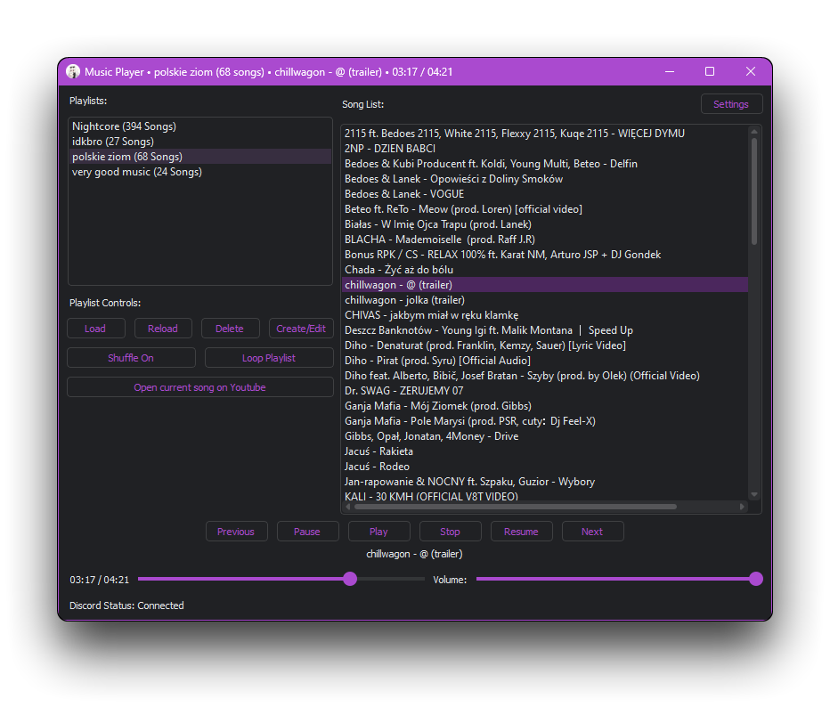
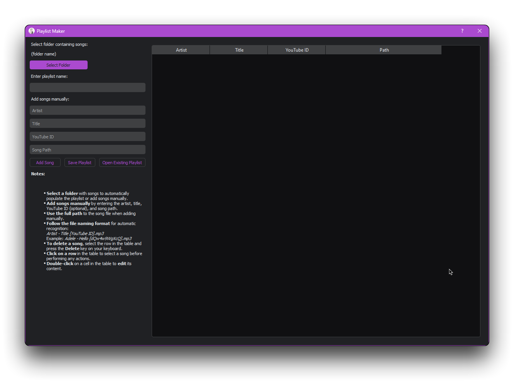
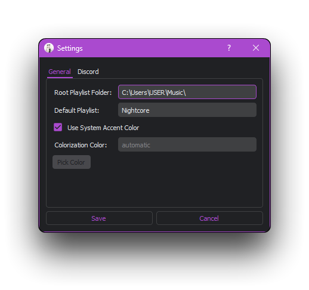
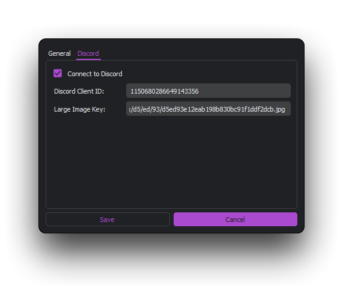

# Iota Player

[](https://github.com/qwertyquerty/pypresence)

[](https://github.com/vorlie/IotaPlayer/blob/master/LICENSE) 


[License](LICENSE) • [Contributing](CONTRIBUTING.md) • [Gallery](#gallery) •  [Installation](#installation) • [Troubleshooting](#troubleshooting) • [Configuration](#configuration) •
[Core Features](#core-features) • [User Interface](#user-interface) • [Shortcuts](#shortcuts) • [Logging](#logging) • [Playlist Maker](#playlist-maker) •
[Usage](#usage)

A feature-rich music player application with playlist management, playback controls, song information display, volume and progress tracking, Discord integration, and more.

## Very Special Thanks!
 - [DarkDetect](https://github.com/albertosottile/darkdetect) for the source code for windows dark mode detection.
    - Where used? [Here](utils/_detect_windows_theme.py) It was used as a base for getting ColorizationColor from the registry.

## Features

### TODO:
[Moved here](https://github.com/users/vorlie/projects/3/views/1)

### Core Features

- **Playlists Management:**
  - **Load Playlist:** Load playlists from a specified directory.
  - **Reload Playlists:** Refresh the list of available playlists.
  - **Delete Playlist:** Remove a selected playlist.
  - **Create/Edit Playlist:** Use the [Playlist Maker](#playlist-maker) to create or edit playlists.

- **Music Playback Controls:**
  - **Play/Pause/Resume/Stop:** Start, pause, resume, or stop the currently playing song.
  - **Previous/Next:** Skip to the previous or next song in the playlist.
  - **Loop/Shuffle:** Toggle loop and shuffle modes.

- **Song Information:**
  - **Display Song Info:** Show details of the currently playing song (artist and title).
  - **Update Window Title:** Reflect the current song info and playlist in the window title.

- **Volume Control:**
  - **Adjust Volume:** Change playback volume via a slider.

- **Progress Tracking:**
  - **Track Progress:** Display and update the progress of the currently playing song.
  - **Format Time:** Convert elapsed time and total duration into a readable format.

- **Discord Integration:**
  - **Update Discord Status:** Display the current song info in Discord status.
  - **Custom Presence Images:** Display custom playlist images in Discord status.
  - **Check Discord Connection:** Monitor and display connection status to Discord.

- **Key Bindings:**
  - **Media Keys:** Handle media keys for play/pause, next, and previous track.

- **External Actions:**
  - **Open YouTube:** Open the YouTube video for the current song, if available.

### User Interface

- **Accent Color:**
  - With the settings page added, you can change most of the settings directly from the application.
  - **Use System Accent Color:** Use the system's accent color. (Windows and macOS only)
    - In order to use the system's accent color, you must set the `automatic` value for the `colorization_color` in the [config.json](config.json#L15) file.
  - **Set your own Accent Color:** Specify the hex color code of the accent color.
    - In order to use your own accent color, you must set the `your_hex_color` value for the `colorization_color` in the [config.json](config.json#L15) file.

- **Playlists and Songs Display:**
  - **Playlist List:** Show available playlists and their song counts.
  - **Song List:** Display the list of songs in the currently loaded playlist.

- **Controls and Layouts:**
  - **Control Buttons:** Various buttons for playback control, playlist management, and external actions.
  - **Sliders:** For adjusting volume and tracking song progress.
  - **Labels:** For displaying song info, playback time, and Discord status.

- **Dialogs:**
  - **Open Playlist Dialog:** Select and load playlists.

### Shortcuts

- **Delete Playlist**: Select a playlist and press the `Delete` key to remove it from the list.
  - **Delete Song**: [(From Playlist Maker)](#playlist-maker) Select the song and press the `Delete` key to remove it from the playlist.
- **Play/Pause**: Use the `Media Play/Pause` (`FN + F7`) key to toggle play/pause.
- **Next Track**: Use the `Media Next` (`FN + F6`) key to skip to the next track.
- **Previous Track**: Use the `Media Previous` (`FN + F5`) key to return to the previous track.

### Logging

- **Logging Setup:**
  - **Console Logging:** Output logs to the console.
  - **File Logging:** Save logs to a rotating file for persistent records.

## Installation

1. **Clone the repository:**

    ```bash
    git clone https://github.com/vorlie/IotaPlayer.git
    ```

2. **Navigate to the project directory:**

    ```bash
    cd IotaPlayer
    ```

3. **Install the required dependencies:**

    ```bash
    pip install PyQt5==5.15.10
    pip install pygame==2.6.0
    pip install git+https://github.com/qwertyquerty/pypresence.git@master
    pip install mutagen==1.47.0
    pip install pynput==1.7.7
    pip install git+https://github.com/vorlie/PyQtDarkTheme.git@main --ignore-requires-python
    ```

4. **Ensure you have the necessary environment variables and configuration files:**
    - Create a `config.json` file with necessary configuration details.
        - Otherwise the application will generate a default configuration.
    - Add your Discord client ID in the appropriate place if needed.
        - The default value is `1150680286649143356`.

5. **Building from source using pyinstaller:**
    - If planning to build from source.

      ```bash
      pip install pyinstaller==6.6.0
      ```
      ```bash
      pyinstaller IotaPlayerWIN.spec
      ```
    - If you want console output:
      - Change the `console` value to `True` in the `IotaPlayerWIN.spec` file. If you decide to leave it as `False`, then be aware of how PyInstaller works, it can trigger your anti virus.
        ```spec
          exe = EXE(
            pyz,
            a.scripts,
            [],
            exclude_binaries=True,
            name='IotaPlayer',
            debug=False,
            bootloader_ignore_signals=False,
            strip=False,
            upx=True,
            console=False,
            disable_windowed_traceback=False,
            argv_emulation=False,
            target_arch=None,
            codesign_identity=None,
            entitlements_file=None,
            icon=['icon.ico'],
          )
        ```
## Usage

1. **Run the application:**

    ```bash
    python main.py
    ```
    or use the executable you built in the previous step.
    
2. **Control the application:**
    - Use the UI buttons to control playback, manage playlists, and access external actions.
    - Use media keys on your keyboard to control playback.

3. **Create/Edit Playlists:**
    - Access the Playlist Maker to create or edit playlists.

4. **Discord Integration:**
    - The application will automatically update your Discord status with the current song info if connected.

## Configuration
**With the settings page added, you can change most of the settings directly from the application.**
- **`config.json`:** Place your configuration settings here. Example:
    - If file is not present, application will create it with default values.
    ```json
      {
          "discord_comments": {
              "1": "Connect to Discord? If set to true, application will try to connect to discord in order to set your presence.",
              "2": "Set it to false if you don't want to connect to Discord.",
              "3": "The default value is 'true'.",
              "4": "Enter your Discord Client ID. You can find it in your Discord Developer Portal.",
              "5": {
                  "1":"Enter your Discord Large Image Key. You can find it in your Discord Developer Portal.",
                  "2":"You can use links as well.",
                  "3":"The default value is 'default_image'."
              }
          },
          "connect_to_discord": true,
          "discord_client_id": "1150680286649143356",
          "large_image_key": "default_image",

          "root_playlist_folder_comment": {
              "1": "Specify the directory where your playlists are saved. You can change this path if needed.",
              "2": "The default value is 'playlists'."
          },
          "root_playlist_folder": "playlists",
          "default_playlist_comment": "Enter the name of the default playlist that will be loaded initially. You can modify this name as required.",
          "default_playlist": "default",
          "colorization_color_comment": {
              "1": "Enter the hex color code of the accent color. You can modify this color as required.",
              "2": "If set to 'automatic' the application will use the system's accent color.",
              "3": "The default value is 'automatic'."
          },
          "colorization_color": "automatic"
      }
    ```

- **Logging Configuration:**
    - In `musicPlayer.py` there are commented logging configurations. Uncomment them to use them.
        - Logs are written to `combined_app.log` for application and discord logs.

## Playlist Maker

The `PlaylistMaker` class provides a user-friendly interface for creating and managing playlists. It allows users to select folders containing songs, add songs manually, and save playlists in JSON format. 

### Features

- **Select Folder**: Automatically populate the playlist with songs from a selected folder.
- **Add Songs Manually**: Enter song details manually including artist, title, YouTube ID, and song path.
- **Save Playlist**: Save the created playlist in JSON format.
- **Open Existing Playlist**: Load and edit an existing playlist.
- **Edit Songs**: Double-click on a song entry to edit its details.
- **Delete Songs**: Select a song and press the Delete key to remove it.

### How to Use

1. **Select Folder**:
   - Click on the "Select Folder" button to choose a folder containing MP3 files.
   - The application will automatically process the folder and add all MP3 files matching the naming pattern to the playlist.

2. **Add Songs Manually**:
   - Fill in the "Artist", "Title", "YouTube ID" (optional), and "Song Path" fields.
   - Click the "Add Song" button to add the song to the playlist.

3. **Save Playlist**:
   - Enter a name for the playlist in the "Enter playlist name" field.
   - Add a playlist image if you want to. It's optional after all.
   - Click the "Save Playlist" button to save the playlist as a JSON file.

4. **Open Existing Playlist**:
   - Click the "Open Existing Playlist" button to load a playlist.
   - Select the JSON file of the playlist you want to open.

5. **Edit and Delete Songs**:
   - To edit a song, double-click on the corresponding cell in the table.
   - To delete a song, select the row and press the Delete key.

### Naming Scheme

For automatic recognition, the song files in the selected folder should follow this naming scheme:
- **Artist**: The name of the artist.
- **Title**: The title of the song.
- **YouTube ID**: (Optional) The YouTube ID for the song.
    ```
    Artist - Title [YouTube ID].mp3
    ```
    **Example(s)**:
    ```
        Artist - Title [dQw4w9WgXcQ].mp3
        Artist (feat. Artist) - Title (Bass Boosted) [dQw4w9WgXcQ].mp3
    ```

### Example playlist json result

```json
{
    "playlist_name": "name_test",
    "playlist_large_image_key":"https://i.pinimg.com/236x/42/43/03/424303bef006eb35803ae00505248d7a.jpg",
    "song_count": 2,
    "songs": [
        {
            "artist": "Artist 1",
            "title": "Title 1",
            "youtube_id": "dQw4w9WgXcQ",
            "path": "C:\\Users\\USER\\Music\\FOLDER\\Artist 1 - Title 1 [dQw4w9WgXcQ].mp3",
            "playlist": "name_test"
        },
        {
            "artist": "Artist 2",
            "title": "Title 2",
            "youtube_id": "dQw4w9WgXcQ",
            "path": "C:\\Users\\USER\\Music\\FOLDER\\Artist 2 - Title 2 [dQw4w9WgXcQ].mp3",
            "playlist": "name_test"
        }
    ]
}
```

## Troubleshooting

- **Ensure all dependencies are installed:**
  Verify the installation of all required packages.
    ```
    PyQt5==5.15.10
    pygame==2.6.0
    git+https://github.com/qwertyquerty/pypresence.git@master
    mutagen==1.47.0
    pynput==1.7.7
    git+https://github.com/vorlie/PyQtDarkTheme.git@main 
    ```

- **Check Discord connection:**
  Ensure your Discord client ID is correct and that you are connected to Discord.

- **Review logs:**
  Check `combined_app.log` for detailed logging information if issues arise.

## Gallery

<details>
  <summary>Show Gallery</summary>

  

  

  

  
  
</details>

## License

This project is licensed under the MIT License. See the [LICENSE](LICENSE) file for details.

## Thanks

- **[PyQt5](https://www.riverbankcomputing.com/software/pyqt/intro)**: A set of Python bindings for the Qt application framework, which provides the GUI capabilities for this application.
- **[qdarktheme](https://github.com/vorlie/PyQtDarkTheme)**: A library for applying dark themes to PyQt5 applications, enhancing the visual appeal of the interface.
- **[pygame](https://www.pygame.org/)**: A cross-platform set of Python modules designed for writing video games, providing functionality for sound and music.
- **[pypresence](https://pypi.org/project/pypresence/)**: A Python library for integrating with Discord's Rich Presence, allowing you to display custom activity information.
- **[mutagen](https://mutagen.readthedocs.io/en/latest/)**: A Python module used for handling audio metadata, enabling the application to read and write metadata in audio files.
- **[pynput](https://pynput.readthedocs.io/en/latest/)**: A library for controlling and monitoring input devices, such as keyboards and mice.
- **[pyinstaller](https://www.pyinstaller.org/)**: A tool for converting Python applications into stand-alone executables, allowing for easier distribution and deployment.
