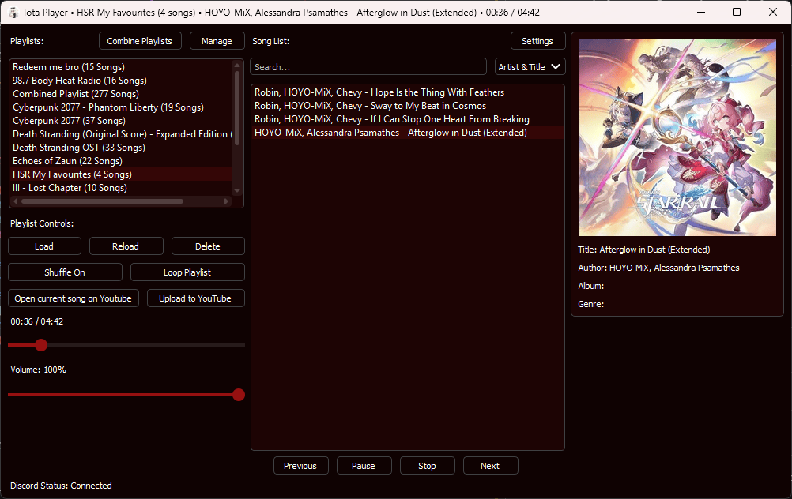
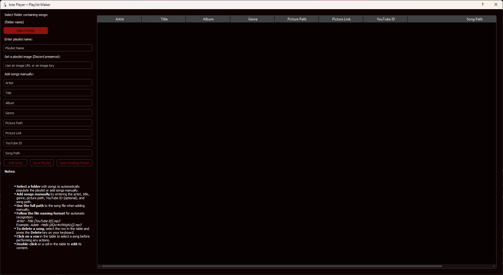
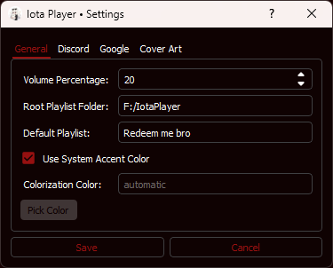

# Iota Player

[](https://ko-fi.com/vorlie)
[](https://github.com/qwertyquerty/pypresence)
[](https://github.com/vorlie/IotaPlayer/blob/master/LICENSE)

Iota Player is a feature-rich desktop music player for Windows and Linux. It's designed for users who want seamless playlist management, powerful playback controls, and deep integration with services like Discord and YouTube.

[**View the To-Do List on GitHub Projects**](https://github.com/users/vorlie/projects/3/views/1)

-----

## Table of Contents

  - [Gallery](https://www.google.com/search?q=%23gallery)
  - [Core Features](https://www.google.com/search?q=%23core-features)
  - [Installation](https://www.google.com/search?q=%23installation)
  - [Usage](https://www.google.com/search?q=%23usage)
  - [Playlist Maker](https://www.google.com/search?q=%23playlist-maker)
  - [Configuration](https://www.google.com/search?q=%23configuration)
  - [Troubleshooting](https://www.google.com/search?q=%23troubleshooting)
  - [Shortcuts](https://www.google.com/search?q=%23shortcuts)
  - [Advanced](https://www.google.com/search?q=%23advanced)
  - [Acknowledgments](https://www.google.com/search?q=%23acknowledgments)
  - [License](https://www.google.com/search?q=%23license)

-----

## Gallery

<details>
  <summary>Show Gallery</summary>

| Main Window | Playlist Maker | Settings |
| :---: | :---: | :---: |
|  |  |  |


</details>

-----

## Core Features

Iota Player comes packed with features to enhance your music listening experience.

### Playlist Management

  - **Create & Edit:** Use the dedicated [Playlist Maker](https://www.google.com/search?q=%23playlist-maker) to build or modify playlists.
  - **Load & Reload:** Load playlists from your library and refresh the list on demand.
  - **Combine:** Merge songs from multiple playlists into a single, unified playlist.
  - **Delete:** Easily remove playlists you no longer need.

### Playback & Audio

  - **Standard Controls:** Play, pause, resume, stop, next, and previous track.
  - **Loop & Shuffle:** Toggle repeat and shuffle modes for your playlists.
  - **Seek Bar:** Instantly jump to any point in a song with a draggable progress bar.
  - **Volume Control:** Adjust volume with a simple slider.
  - **Reliable Engine:** Uses PyQt5's native `QMediaPlayer` for stable and integrated playback.

### Display & Interface

  - **Song Information:** View the artist, title, album, and genre of the current track.
  - **Dynamic Window Title:** The window title updates to show the currently playing song.
  - **Customizable Accent Color:** Personalize the UI by setting a custom accent color or using your system's default (Windows & macOS).
  - **Cover Art:** Automatically extracts, caches, and crops embedded album art to a 1:1 aspect ratio for a clean, uniform look.

### Integrations

  - **Discord Rich Presence:**
      - Broadcast your current song as your Discord status.
      - Status updates instantly when you seek, pause, or change tracks.
      - Display custom playlist images.
  - **YouTube:**
      - Upload your local playlists directly to your YouTube account.
      - Open the YouTube video for the currently playing song in your browser.
  - **Media Key Support:** Control playback using your keyboard's media keys (play/pause, next, previous).

-----

## Installation

### Windows

  - **Recommended:** Download the latest `.exe` or `.zip` file from the [**Releases Page**](https://github.com/vorlie/IotaPlayer/releases). Simply run the installer or extract the zip file to get started.
  - **From Source:** You can also run it from the source code by following the Linux instructions below, ensuring you have Python 3.12+ and all required dependencies.

### Linux (and other platforms)

No pre-built binaries are provided for Linux due to the variety of distributions. You must install from source.

**1. System Requirements:**

  - **Python 3.12 or newer.**
  - **GStreamer:** Required for audio playback.
  - **PyQt5:** For the user interface.

**2. Install System Dependencies (Example for Ubuntu/Debian):**

```sh
sudo apt update
sudo apt install python3 python3-pip python3-venv python3-pyqt5 python3-pyqt5.qtmultimedia \
  gstreamer1.0-plugins-base gstreamer1.0-plugins-good \
  gstreamer1.0-plugins-bad gstreamer1.0-plugins-ugly gstreamer1.0-libav \
  libxcb-xinerama0
```

> **Note:** You may need to install other packages depending on your distribution. Refer to the [Troubleshooting](https://www.google.com/search?q=%23troubleshooting) section for help with potential Qt errors.

**3. Clone the Repository:**

```sh
git clone https://github.com/vorlie/IotaPlayer.git
cd IotaPlayer
```

**4. Set up a Virtual Environment (Recommended):**

```sh
python3 -m venv venv
source venv/bin/activate
```

**5. Install Python Dependencies:**

```sh
pip3 install -r requirements.txt --ignore-requires-python
```

**6. Run the Application:**

```sh
python main.py
```

-----

## Usage

1.  **Launch the application** using the executable or by running `python main.py`.
2.  **Manage Playlists:** Use the UI buttons to load, create, or delete playlists.
3.  **Control Playback:** Use the on-screen controls or your keyboard's media keys.
4.  **Customize:** Open the **Settings** dialog to configure Discord integration, accent colors, and other options.

-----

## Playlist Maker

The `PlaylistMaker` is a built-in tool for creating and managing your `.json` playlists.

### How to Use

1.  **Open Existing Playlist:** Click to load and edit an existing `.json` playlist file.
2.  **Select Folder:** Automatically add all compatible audio files from a folder. Songs must follow the naming scheme below for metadata to be recognized.
3.  **Add Songs Manually:** Fill in the fields and click "Add Song" to add a single track.
4.  **Edit & Delete:** Double-click a song in the list to edit it. Select a song and press the `Delete` key to remove it.
5.  **Save Playlist:** Enter a playlist name, add an optional cover image link, and click "Save Playlist".

### Naming Scheme for Auto-Recognition

For the "Select Folder" feature to work best, your files should be named like this:
`Artist - Title [YouTube ID].mp3`

**Examples:**

  - `Artist - Title [dQw4w9WgXcQ].mp3`
  - `Artist (feat. Other) - Title (Remix) [abcdef12345].mp3`

-----

## Configuration

You can configure Iota Player via the in-app **Settings** menu. These settings are stored in `config.json`. The file is created automatically with default values if it doesn't exist.

### `config.json` Example

```json
{
    "connect_to_discord": true,
    "discord_client_id": "1150680286649143356",
    "large_image_key": "default_image",
    "use_playing_status": false,
    "root_playlist_folder": "playlists",
    "default_playlist": "default",
    "colorization_color": "automatic",
    "volume_percentage": 100,
    "google_client_secret_file": "path/to/client_secret.json"
}
```

### Google API Setup (for YouTube Upload)

To use the YouTube playlist upload feature, you need to set up Google API credentials. For full instructions, please see the [**GOOGLE.md**](GOOGLE.md) guide.

-----

## Troubleshooting

  - **Codec Errors:** On Windows, some `.mp3` files may fail to play if they have long ID3 tags. This can cause errors like `DirectShowPlayerService::doRender: Unresolved error code 80040266`. Installing a codec pack like [K-Lite](https://codecguide.com/download_kl.htm) usually resolves this. On Linux, ensure you have installed all the `gstreamer1.0-plugins-*` packages listed in the installation section.

  - **Python Version:** This app requires **Python 3.12 or newer**. Verify your version with `python3 --version`.

  - **Qt Platform Errors (Linux):** If you see `xcb` or other platform plugin errors, you may need to install additional libraries:

    ```sh
    sudo apt install libxcb-xinerama0 libxcb1 libx11-xcb1 libgl1-mesa-glx
    ```

    If you are using Wayland, you can try forcing the platform to XCB before running the app:

    ```sh
    export QT_QPA_PLATFORM=xcb
    python main.py
    ```

  - **Check Logs:** For detailed error information, check the `combined_app.log` file in the application directory.

-----

## Shortcuts

  - **Delete Playlist:** Select a playlist and press `Delete`.
  - **Delete Song (in Playlist Maker):** Select a song and press `Delete`.
  - **Media Keys:**
      - **Play/Pause:** `Media Play/Pause` (e.g., FN + F7)
      - **Next Track:** `Media Next` (e.g., FN + F6)
      - **Previous Track:** `Media Previous` (e.g., FN + F5)

-----

## Advanced

### Logging

Logging is configured in `musicPlayer.py`. By default, logs are output to both the console and a rotating file named `combined_app.log`. You can uncomment different logging configurations in the source code if needed.

### Building from Source

If you wish to build a standalone `.exe` file on Windows:

1.  **Install PyInstaller:**
    ```sh
    pip install pyinstaller==6.6.0
    ```
2.  **Build the Executable:**
    ```sh
    pyinstaller IotaPlayerWIN.spec
    ```
    > You can set `console=True` in the `.spec` file to create a build with a command-line console for debugging.

-----

## Acknowledgments

### Special Thanks

  - **[DarkDetect](https://github.com/albertosottile/darkdetect):** Provided the source code base for detecting Windows dark mode and accent colors.

### Dependencies

This project is built with the help of these libraries:

  - **[PyQt5](https://www.riverbankcomputing.com/software/pyqt/intro)**: For the graphical user interface.
  - **[qdarktheme](https://github.com/vorlie/PyQtDarkTheme)**: For easy dark/light theme integration.
  - **[pypresence](https://pypi.org/project/pypresence/)**: For Discord Rich Presence integration.
  - **[mutagen](https://mutagen.readthedocs.io/en/latest/)**: For reading and handling audio metadata.
  - **[pynput](https://pynput.readthedocs.io/en/latest/)**: For listening to global media key presses.
  - **[pyinstaller](https://www.pyinstaller.org/)**: For packaging the application into an executable.

-----

## License

This project is licensed under the MIT License. See the [**LICENSE**](https://www.google.com/search?q=LICENSE) file for details.